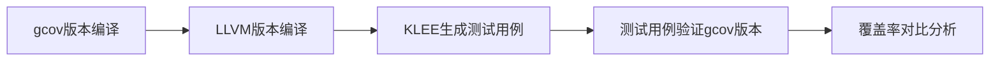

# KLEE 符号执行实验完整复现指南

## 0. 参考资料
- [OSDI'08 Coreutils Experiments](https://klee-se.org/docs/coreutils-experiments/)：说明 KLEE 在 [OSDI'08 论文](https://llvm.org/pubs/2008-12-OSDI-KLEE.pdf) 中用于实验 GNU Coreutils 的具体构建环境、软件版本、测试工具与参数配置等细节。
- [Using KLEE with Docker](https://klee-se.org/docker/)：介绍如何通过 Docker 容器快速获取、运行与使用 KLEE，包括拉取镜像、创建容器和持久化使用等实用操作说明。
- [KLEE's main command-line options](https://klee-se.org/docs/options/)：详细说明了 KLEE 的各种命令行选项，包括输出控制、符号环境设置、搜索策略、约束求解、外部函数调用策略、调试选项、内存管理、统计信息和执行树控制等配置参数。
- [KLEE intrinsic functions](https://klee-se.org/docs/intrinsics/)：介绍了 KLEE 符号执行引擎的内置函数（intrinsics），主要包括 `klee_assume(condition)` 用于约束符号变量的取值范围，以及 `klee_prefer_cex(object, condition)` 用于在生成测试用例时偏好特定值，同时详细解释了这些函数的使用方法和注意事项。
- [Auxiliary tools provided by KLEE](https://klee-se.org/docs/tools/)：介绍了 KLEE 符号执行引擎提供的辅助工具集，包括：`ktest-tool` 用于将 .ktest 文件转换为人类可读格式，`klee-stats` 用于提取和展示统计信息，`ktest-gen` 用于从具体输入生成 .ktest 文件，`ktest-randgen` 用于生成随机. ktest 文件，以及 `klee-exec-tree` 用于显示执行树的各种统计信息。
- [KLEE solver chain and related command-line options](https://klee-se.org/docs/solver-chain/)：详细介绍了 KLEE 的求解器链（solver chain）架构和相关配置选项，包括：核心求解器（MetaSMT、STP、Z3）的具体配置参数，缓存求解器（分支缓存、反例缓存）的使用方法，独立性求解器用于拆分独立约束集，以及各种调试求解器（赋值验证、调试验证、查询日志等）的配置选项。
- [Kleaver’s main command-line options](https://klee-se.org/docs/kleaver-options/)：KQuery 语言的参考手册，详细介绍了 KLEE 约束求解器使用的文本表示格式，包括：基本语法结构、数组声明、查询命令、版本管理、各种表达式类型（算术运算、位运算、比较运算、位向量操作等），以及特殊表达式如 `Read`、`Select` 和一些宏表达式。
- [KQuery language](https://klee-se.org/docs/kquery/)：简要介绍了 `Kleaver`（KLEE 的独立约束求解器工具）的主要命令行选项，包括：基本用法格式、处理 KQuery 格式文件的解析优化选项（如 `-clear-array-decls-after-query` 用于处理独立查询以减少内存占用）、支持多种后端SMT求解器、以及查询日志记录功能（通过 `-query-log-dir` 指定日志存储位置）。

[官方教程](https://klee-se.org/tutorials/testing-coreutils/)

## 1. 工作流程概览
本教程采用**双版本验证**策略：
1. **gcov 版本** - 用于覆盖率测量和验证
2. **LLVM 版本** - 用于 KLEE 符号执行分析



### 1.1 双版本验证的具体比较机制

验证策略的核心是**使用 gcov 作为独立的"真相来源"**，验证KLEE符号执行结果在真实程序中的有效性：

#### 步骤1：KLEE在LLVM版本上的分析结果
```bash
$ cd ~/coreutils-*/obj-llvm/src
$ pwd
/home/klee/coreutils-6.11/obj-llvm/src
$ klee --optimize --libc=uclibc --posix-runtime ./echo.bc --sym-arg 3
KLEE: done: completed paths = 25
KLEE: done: generated tests = 25

$ klee-stats klee-last
---------------------
|  ICov(%)|  BCov(%)|
|    33.46|    22.66|  # KLEE的覆盖率声明
---------------------
```

#### 步骤2：用测试用例验证 gcov 版本
```bash
$ cd ../../obj-gcov/src
$ rm -f *.gcda  # 清空覆盖率数据
$ klee-replay ./echo ../../obj-llvm/src/klee-last/*.ktest  # 运行25个测试用例

$ gcov echo
File '../../src/echo.c'
Lines executed:52.43% of 103  # gcov的实际测量结果
```

#### 步骤3：关键对比分析

| 指标 | KLEE报告 | gcov报告 | 说明 |
|------|----------|----------|------|
| **覆盖率范围** | 33.46% (所有代码) | 52.43% (仅echo.c) | KLEE计算包含库代码，gcov可专注源文件 |
| **测试用例数** | 25个路径 | 25个文件执行 | 一对一验证KLEE生成用例的有效性 |
| **验证意义** | 符号执行探索 | 真实程序执行 | 确保符号执行结果在实际环境中可重现 |

这种对比验证了：
- ✅ KLEE生成的测试用例在真实程序中确实有效
- ✅ 符号执行发现的路径能够在实际运行中重现
- ✅ 为进一步优化提供基准（如需提高覆盖率，可考虑`--sym-args 0 2 4`等策略）

```bash
$ klee --optimize --libc=uclibc --posix-runtime ./echo.bc --sym-args 0 2 4
KLEE: done: completed paths = 9963 # 远多于之前的测试用例数量
KLEE: done: generated tests = 9963

$ klee-stats klee-last
---------------------
|  ICov(%)|  BCov(%)|
|    34.95|    24.22|  # 新的 KLEE 覆盖率声明
---------------------
$ cd ../../obj-gcov/src
$ rm -f *.gcda
$ klee-replay ./echo ../../obj-llvm/src/klee-last/test000[01]*.ktest 2>&1 | grep 'KLEE-REPLAY: NOTE: Test file'  # 测试用例太多，只运行一部分
$ gcov echo
File '../../src/echo.c'
Lines executed:66.99% of 103  # gcov 的实际测量结果出现显著提高
# 注意，经过测试，如果在上面的`klee-replay`阶段依次把所有的测试用例都跑一遍，该覆盖率甚至可以提高到：98.06%
```

## 2. 编译包含 Coreutils 的 Klee 镜像
```Dockerfile
# 请参照上级目录下的Dockerfile
```

### 2.1 构建gcov版本（用于覆盖率验证）
```bash
$ mkdir obj-gcov
$ cd obj-gcov
$ ../configure --disable-nls CFLAGS="-g -fprofile-arcs -ftest-coverage"
$ make check && make
```

**gcov的作用：**
- 提供独立的覆盖率验证机制
- 验证KLEE生成的测试用例在真实程序上的实际覆盖率
- 生成`.gcda`文件记录执行路径，用于后续`klee-replay`验证

**配置参数解释：**
- `--disable-nls`: 禁用国际化支持，减少C库初始化复杂度
- `-fprofile-arcs -ftest-coverage`: 生成的可执行文件会记录执行路径，运行后产生 `.gcda` 文件（覆盖率数据）

### 2.2 构建LLVM字节码版本
```bash
$ cd ../  # 回到coreutils-6.11目录
$ mkdir obj-llvm
$ cd obj-llvm

# 使用WLLVM编译器配置
$ CC=wllvm ../configure --disable-nls \
    CFLAGS="-g -O1 -Xclang -disable-llvm-passes -D__NO_STRING_INLINES -D_FORTIFY_SOURCE=0 -U__OPTIMIZE__"
$ make
$ make -C src arch hostname
```

**关键编译标志说明：**
- `-O1 -Xclang -disable-llvm-passes`: 优化编译同时保持KLEE兼容性
- `-D__NO_STRING_INLINES -D_FORTIFY_SOURCE=0 -U__OPTIMIZE__`: 防止clang生成KLEE不支持的安全库函数

**提取LLVM字节码：**
```bash
$ cd src
$ find . -executable -type f | xargs -I '{}' extract-bc '{}'
# 生成 .bc 文件供KLEE分析
```

### 2.3 sort工具特殊修改

**必要性：** sort的默认内存配置会导致KLEE内存溢出和求解器超时。

**修改方法：**
```bash
# 在coreutils源码目录执行
$ pwd
/home/klee/coreutils-6.11
$ sed 's/#define INPUT_FILE_SIZE_GUESS.*/#define INPUT_FILE_SIZE_GUESS 1024/g' -i src/sort.c
```

**修改对比：**
```c
// 修改前（会导致KLEE失败）
#define INPUT_FILE_SIZE_GUESS (1024 * 1024)  // 1MB

// 修改后（KLEE可处理）
#define INPUT_FILE_SIZE_GUESS 1024           // 1KB
```

**影响：**
- ✅ 解决KLEE内存限制问题，避免`memory allocation failed`错误
- ✅ 显著提升符号执行性能（1000倍复杂度降低）
- ✅ 保持sort核心功能和代码覆盖率
- ⚠️ 仅影响初始缓冲区大小，大文件时程序会自动扩展

**验证：** 修改后KLEE能成功分析sort并生成测试用例，而非因内存问题终止。

## 3. 单工具 KLEE 符号执行实验

### 3.1 进入 KLEE 容器环境
```bash
# 启动容器
$ docker run --rm -it -e DISPLAY=:1 \
    --ulimit='stack=-1:-1' \
    -w /home/klee/coreutils-6.11/obj-llvm/src \
    -v /tmp/.X11-unix:/tmp/.X11-unix:rw \
    klee-coreutils:${VER} \
    bash
```

### 3.2 准备测试环境
```bash
# 进入字节码目录
$ cd /home/klee/coreutils-6.11/obj-llvm/src

# 创建沙盒测试环境
$ mkdir -p /tmp/sandbox
$ cd /tmp/sandbox

# 创建环境变量文件
$ cat > test.env << 'EOF'
PATH=/usr/bin:/bin
HOME=/tmp/sandbox
PWD=/tmp/sandbox
EOF
```

**说明**（为何需要 test.env）

这个文件定义了 KLEE POSIX 运行时启动时加载的一个最小、可复现实验环境（配合 `--env-file` 使用），并与 `--run-in-dir=/tmp/sandbox` 搭配，让被测程序始终在受控目录中运行，避免读取宿主机的 `~/.bashrc`、用户配置或随机路径，从而消除非确定性与副作用。当前三项含义：

- PATH=/usr/bin:/bin：只保留系统基础路径，避免误调用宿主上其它可执行文件；
- HOME=/tmp/sandbox：把家目录指向沙盒，防止向真实 $HOME 读写；
- PWD=/tmp/sandbox：与 `--run-in-dir` 保持一致，保证 getcwd() 与相对路径行为一致。

如需更强可重复性，可再加入 `LANG=C`/`LC_ALL=C` 以屏蔽本地化差异（对 `sort`/`printf` 一类命令尤为有用）。参考：官方 Coreutils 复现实验使用相同思路生成 test.env 并在沙盒中运行；`--env-file`/`--run-in-dir` 为 KLEE 的标准启动选项。   

### 3.3 基础符号执行实验

**最简单的符号执行示例（echo工具）：**
```bash
$ cd /home/klee/coreutils-6.11/obj-llvm/src
$ klee --libc=uclibc --posix-runtime ./echo.bc --sym-args 0 1 10
```

最小示例，只给 echo 一个符号化命令行参数（0~1 个参数，长度最多 10 字符），用来演示 KLEE 如何探索输入空间。

**标准符号参数配置：**
```bash
# OSDI'08论文中使用的标准配置
$ klee --libc=uclibc --posix-runtime \
    --env-file=/tmp/sandbox/test.env \
    --run-in-dir=/tmp/sandbox \
    ./echo.bc \
    --sym-args 0 1 10 --sym-args 0 2 2 --sym-files 1 8 --sym-stdin 8 --sym-stdout
```

这是 [OSDI'08 论文](https://llvm.org/pubs/2008-12-OSDI-KLEE.pdf) 的标准配置。它不仅符号化命令行参数，还符号化文件、标准输入/输出，并在受控的沙盒环境中运行，以覆盖更多 I/O 相关路径，复现论文中的 Coreutils 实验效果。

符号输入参数解释

- `--sym-args 0 1 10`：允许 0~1 个命令行参数，每个长度最多 10 字符。注意，在 [OSDI'08 论文](https://llvm.org/pubs/2008-12-OSDI-KLEE.pdf) 中，实际使用的只有一个参数：`--sym-args 1 10 10`
- `--sym-args 0 2 2`：再额外允许 0~2 个命令行参数，每个长度最多 2 字符。双 `--sym-args` 只出现在 [Coreutils 实验（OSDI'08 附加资料）](https://klee-se.org/docs/coreutils-experiments/) 中。这个是通过叠加多组参数规则，组1：0~1个长参数（≤10字符），组2：0~2个短参数（≤2字符），来更精细地模拟“少量长参数 + 多个短参数”的情况。在 Coreutils 里，这很有用：
    - **长参数**（比如 --version、--help）一般比较长。
	- **短选项**（比如 -a, -l）往往只有 1~2 个字符。

    用两次 --sym-args，就能同时探索这两类输入。
- `--sym-files 1 8`：创建 1 个符号化文件（名字为 A），大小 8 字节。
- `--sym-stdin 8`：标准输入符号化，大小 8 字节。
- `--sym-stdout`：标准输出也符号化，用于探索写出不同结果的路径。

这些参数组合起来，可以让 KLEE 模拟命令行参数、输入文件、标准输入输出等多种来源，从而覆盖 Coreutils 工具的大部分行为。

### 3.4 高级符号执行配置

**推荐的优化执行命令：**
```bash
$ klee --simplify-sym-indices --write-cvcs --write-cov --output-module \
    --max-memory=1000 --disable-inlining --optimize --use-forked-solver \
    --use-cex-cache --libc=uclibc --posix-runtime \
    --external-calls=all --only-output-states-covering-new \
    --max-sym-array-size=4096 --max-solver-time=30s --max-time=60min \
    --watchdog --max-memory-inhibit=false --max-static-fork-pct=1 \
    --max-static-solve-pct=1 --max-static-cpfork-pct=1 --switch-type=internal \
    --search=random-path --search=nurs:covnew \
    --use-batching-search --batch-instructions=10000 \
    --env-file=/tmp/sandbox/test.env --run-in-dir=/tmp/sandbox \
    ./echo.bc --sym-args 0 1 10 --sym-args 0 2 2 --sym-files 1 8 --sym-stdin 8 --sym-stdout
```

#### 3.4.1 通用参数（分组）

##### 执行环境配置
| 参数 | 功能 | 作用 |
|------|------|------|
| `--libc=uclibc` | 使用 klee-uclibc 库 | 提供 POSIX 兼容的 C 标准库支持，避免外部未建模函数导致路径终止 [LLVM 2.9](https://klee-se.org/releases/docs/v1.3.0/build-llvm29) |
| `--posix-runtime` | 启用 POSIX 运行时 | 支持命令行参数、环境变量、文件系统模型，便于真实程序测试 [Tutorial](https://klee-se.org/tutorials/testing-coreutils/) |
| `--env-file=/tmp/sandbox/test.env` | 环境变量文件 | 从 `test.env` 读取固定环境变量，保证实验可复现 |
| `--run-in-dir=/tmp/sandbox` | 沙盒目录 | 在指定目录下运行，被测程序与宿主机隔离，保证可重复性 |

##### 符号执行优化
| 参数 | 功能 | 作用 |
|------|------|------|
| `--simplify-sym-indices` | 符号索引简化 | 对数组索引和复杂表达式进行归约，减少约束复杂度 |
| `--disable-inlining` | 禁止函数内联 | 保持函数调用边界，便于覆盖率统计和调试 |
| `--optimize` | 启用优化 | 在执行前对 bitcode 运行 LLVM 优化（死代码消除、常量折叠），减少冗余路径 [Coreutils Tutorial](https://klee-se.org/tutorials/testing-coreutils/) |
| `--write-cvcs` / `--write-cov` / `--output-module` | 输出调试与覆盖率数据 | 生成约束日志（CVC/KQuery）、覆盖率片段和最终 LLVM IR，便于复现实验与调试 |

##### 求解器与内存管理
| 参数 | 功能 | 作用 |
|------|------|------|
| `--use-forked-solver` | 独立进程调用约束求解器 | 在子进程中运行 SMT solver，避免内存泄漏或崩溃影响主进程 [Solver Chain](https://klee-se.org/docs/solver-chain/) |
| `--use-cex-cache` | Counterexample 缓存 | 缓存之前的可满足赋值（counterexamples），避免重复求解 [Solver Chain](https://klee-se.org/docs/solver-chain/) |
| `--external-calls=all` | 允许外部函数调用 | 对所有外部函数调用进行“具体化”，保证程序能继续运行 [Options](https://klee-se.org/docs/options) |
| `--max-solver-time=30s` | 单次求解器上限 | 每个约束查询最多 30 秒，防止求解卡死 [Solver Chain](https://klee-se.org/docs/solver-chain/) |
| `--max-sym-array-size=4096` | 符号数组大小限制 | 限制符号数组的最大字节数，防止约束爆炸 |
| `--max-memory=1000` | 最大内存限制 | 限制 KLEE 总内存消耗为 1000 MB，避免 OOM 崩溃 |
| `--max-memory-inhibit=false` | 内存溢出策略 | 内存超限时继续运行（丢弃部分状态）而非立即终止 |
| `--watchdog` | 守护进程 | 监控 KLEE 主进程，超时或崩溃时强制终止 |
| `--max-time=60min` | 最大执行时间 | 限制整体探索时长为 60 分钟，避免无限运行 |
| `--max-static-fork-pct=1` / `--max-static-solve-pct=1` / `--max-static-cpfork-pct=1` | 静态比例参数 | 限制单个状态在分叉、求解和约束传播中的资源占用比例，避免“资源垄断” |

##### 搜索与调度策略
| 参数 | 功能 | 作用 |
|------|------|------|
| `--switch-type=internal` | 状态切换策略 | 使用内部调度器控制状态切换方式 |
| `--search=random-path` | 随机路径搜索 | 从路径树随机选择一条路径继续探索，避免路径爆炸 [Options](https://klee-se.org/docs/options) |
| `--search=nurs:covnew` | NURS 策略 | 非均匀随机搜索，优先选择能覆盖新指令的状态，提高覆盖率 [Options](https://klee-se.org/docs/options) |
| `--use-batching-search` + `--batch-instructions=10000` | 批量执行 | 每个状态连续运行 10000 条指令再切换，减少调度开销 [Options](https://klee-se.org/docs/options) |
| `--only-output-states-covering-new` | 限制输出状态 | 仅保存覆盖新代码行或触发错误的状态，减少冗余测试 [Tutorial](https://klee-se.org/tutorials/testing-coreutils/) |

#### 3.4.2 符号参数策略详解

| 参数 | 功能 | 作用 | 示例 |
|------|------|------|------|
| `--sym-args MIN MAX LEN` | 符号化命令行参数 | 生成 **MIN~MAX 个参数**，每个最大长度为 LEN。可多次使用以模拟不同类别参数（如短选项与长选项）。 | `--sym-args 0 1 10` → 允许 0~1 个长参数（≤10 字符）。<br>`--sym-args 0 2 2` → 允许 0~2 个短参数（≤2 字符）。 [Options](https://klee-se.org/docs/options) |
| `--sym-files N SIZE` | 符号化文件 | 创建 **N 个符号文件**（命名为 `A`、`B`、…），每个最大 SIZE 字节。 | `--sym-files 1 8` → 创建 1 个 8 字节大小的符号文件 `A`。 [Options](https://klee-se.org/docs/options) |
| `--sym-stdin SIZE` | 符号化标准输入 | 将标准输入建模为符号数据，最大 SIZE 字节。 | `--sym-stdin 8` → 符号化输入最多 8 字节。 [Options](https://klee-se.org/docs/options) |
| `--sym-stdout` | 符号化标准输出 | 将标准输出符号化，探索不同输出路径。 | `--sym-stdout` → 所有写入 stdout 的内容均符号化。 [Options](https://klee-se.org/docs/options) |

---

**`--sym-args` 参数的一次写法 vs 多次写法：**

- **一次写法**（如 `--sym-args 1 3 5`）：所有参数统一长度限制（≤5），简单但不灵活。
- **多次写法**（如 `--sym-args 0 1 10 --sym-args 0 2 2`）：可同时建模“长选项”（如 `--help`）和“短选项”（如 `-a`、`-l`），更贴近真实命令行使用习惯，覆盖率更高 [OSDI'08 Coreutils Experiments](https://klee-se.org/docs/coreutils-experiments/)。

**89个工具的标准配置：**
```bash
# 大多数工具使用的标准配置
--sym-args 0 1 10 --sym-args 0 2 2 --sym-files 1 8 --sym-stdin 8 --sym-stdout
```

**特殊工具的扩展配置：** [Coreutils Experiments](https://klee-se.org/docs/coreutils-experiments/)
- **dd**: `--sym-args 0 3 10 --sym-files 1 8 --sym-stdin 8 --sym-stdout`
- **dircolors**: `--sym-args 0 3 10 --sym-files 2 12 --sym-stdin 12 --sym-stdout`
- **echo**: `--sym-args 0 4 300 --sym-files 2 30 --sym-stdin 30 --sym-stdout`
- **expr**: `--sym-args 0 1 10 --sym-args 0 3 2 --sym-stdout`
- **mknod**: `--sym-args 0 1 10 --sym-args 0 3 2 --sym-files 1 8 --sym-stdin 8 --sym-stdout`
- **od**: `--sym-args 0 3 10 --sym-files 2 12 --sym-stdin 12 --sym-stdout`
- **pathchk**: `--sym-args 0 1 2 --sym-args 0 1 300 --sym-files 1 8 --sym-stdin 8 --sym-stdout`
- **printf**: `--sym-args 0 3 10 --sym-files 2 12 --sym-stdin 12 --sym-stdout`
- **sort**: KLEE 不支持多线程，需禁用，因此，需在标准配置上添加：`--parallel=1`

### 3.5 实际测试示例

**测试 `echo` 工具：**
```bash
$ klee --libc=uclibc --posix-runtime \
    --env-file=/tmp/sandbox/test.env --run-in-dir=/tmp/sandbox \
    --max-time=5min --optimize --only-output-states-covering-new \
    ./echo.bc --sym-args 0 4 300 --sym-files 2 30 --sym-stdin 30 --sym-stdout
```

**测试 `sort` 工具（需要特殊处理）：**
```bash
$ klee --libc=uclibc --posix-runtime \
    --env-file=/tmp/sandbox/test.env --run-in-dir=/tmp/sandbox \
    --max-time=60min --optimize --only-output-states-covering-new \
    ./sort.bc --sym-args 0 1 10 --sym-args 0 2 2 --sym-files 1 8 --sym-stdin 8 --sym-stdout -- --parallel=1
```

**注意**：在 KLEE 的命令行中，参数分为三类：

1. **KLEE 自身选项**：如 `--libc=uclibc --posix-runtime --optimize`，由 KLEE 解析。
2. **POSIX runtime 符号化选项**：如 `--sym-args --sym-files --sym-stdin --sym-stdout`，用于构建符号环境。
3. **被测程序参数**：传递给 `<program>.bc` 的真实命令行参数。

`--` 的作用：
- 作为分隔符，告诉 KLEE：后面的内容不再是它的选项，而是要传给被测程序的参数。
- 例如：
  ```bash
  klee ... ./sort.bc --sym-args 0 2 3 -- --parallel=1
  ```

    -   --sym-args 0 2 3 → KLEE 的 POSIX runtime 参数
    -   -- → 分隔符
    -   --parallel=1 → 传递给 sort 程序，用于禁用多线程（KLEE 不支持线程）。

### 3.6 附加测试（以 echo_challenge<x>.c 为例）

#### 3.6.1 编译 echo_challenge<x>.bc

在容器里（或主机映射到容器）使 `/home/klee/coreutils-6.11/obj-llvm/src/echo_challenge<x>.c` 可见，然后：

```bash
VER=6.11
PROD="echo"
MODIFIED_PROD="${PROD}_challenge<x>"

# 进入 Coreutils 工作目录
cd /home/klee/coreutils-${VER}

# 创建沙盒测试环境
mkdir -p /tmp/sandbox

# 创建环境变量文件
cat > /tmp/sandbox/test.env << 'EOF'
PATH=/usr/bin:/bin
HOME=/tmp/sandbox
PWD=/tmp/sandbox
EOF

# 直接编译 bitcode（保留 KLEE 官方教程建议的编译选项习惯）
clang -O1 -Xclang -disable-llvm-passes \
  -D__NO_STRING_INLINES -D_FORTIFY_SOURCE=0 -U__OPTIMIZE__ \
  -emit-llvm -c src/${MODIFIED_PROD}.c -o obj-llvm/src/${MODIFIED_PROD}.bc

# 编译一个 ASan 原生可执行文件，便于对照回放/崩溃现场
clang -fsanitize=address -g -O0 src/${MODIFIED_PROD}.c -o obj-llvm/src/${MODIFIED_PROD}_asan
```

说明：

- `-emit-llvm -c` 直接生成 单模块 .bc（KLEE 会在 `--libc=uclibc --posix-runtime` 下链接运行时，不需要你静态把 uClibc 链进去）。
- 保留 `-O1 -Xclang -disable-llvm-passes` 的组合，避免 `-O0` 带来的 optnone 影响；同时去掉安全替换（`__fprintf_chk` 等）以匹配 KLEE 的建模习惯。
- 你已有的 Coreutils 树与 Docker 环境无需改 build system；适合"挑战程序"独立编译。

#### 3.6.2 测试 echo_challenge<x> 工具：

```bash
cd /home/klee/coreutils-${VER}/obj-llvm/src
klee --libc=uclibc --posix-runtime \
    --env-file=/tmp/sandbox/test.env --run-in-dir=/tmp/sandbox \
    --max-time=1min --optimize --only-output-states-covering-new \
    ./${MODIFIED_PROD}.bc \
    --sym-args 0 1 10 --sym-args 0 2 2 \
    --sym-files 1 8 --sym-stdin 8 --sym-stdout
```

运行后，KLEE 会生成类似如下的警告与错误：

```
warning: Linking two modules of different target triples...
KLEE: WARNING ONCE: Alignment of memory from call "malloc" is not modelled.
option -r requires a number
usage: echo_challenge [-n] [-r N] [args...]
KLEE: ERROR: libc/string/strlen.c:22: memory error: use after free
KLEE: NOTE: now ignoring this error at this location
...
KLEE: HaltTimer invoked
KLEE: halting execution, dumping remaining states

KLEE: done: total instructions = 450338
KLEE: done: completed paths = 291
KLEE: done: partially completed paths = 883
KLEE: done: generated tests = 24
```
可以看到，KLEE 在自动探索时检测到了 use-after-free 等内存错误，并为其生成了对应的 .ktest 文件。
随后，你可以使用 ktest-tool 查看具体输入，或用 klee-replay 在编译好的原生 echo_challenge2 上重现问题。

#### 3.6.3 使用 Makefile

对于 `echo_challeng3.c`，有一个已经准备好的 Makefile，用法如下：

```bash
# 1) 默认运行（无环境变量开关）—— 小规模、快速探测
make -f /home/klee/coreutils-6.11/Makefile_echo_challenge3 clean && make -f /home/klee/coreutils-6.11/Makefile_echo_challenge3 run

# 2) 模糊连接（Obscure join）—— 关注尺寸计算与转义交互的路径
make -f /home/klee/coreutils-6.11/Makefile_echo_challenge3 clean && make -f /home/klee/coreutils-6.11/Makefile_echo_challenge3 run KLEE_ENV="ECHO_JOIN=1"

# 3) 当你看到 completed paths > 0 且开始生成测试用例时，进行第三轮运行，聚焦于标准输出缓冲（stdio buffering）
make -f /home/klee/coreutils-6.11/Makefile_echo_challenge3 clean && make -f /home/klee/coreutils-6.11/Makefile_echo_challenge3 run KLEE_ENV="ECHO_BUF=1 ECHO_HINT=64"
```

#### 3.6.4 KCachegrind

对于 `echo_challenge3.c`，我们可以使用 `KCachegrind` 来进行指令级分析：

- 使用 KCachegrind 打开 `run.istats`，查看哪些函数仍未被覆盖；如果发现 `join_args_obscure` 的覆盖率仍然很低，就说明需要继续保持 `ECHO_JOIN=1`，并逐步增加 `ARG_LEN` 的长度（例如从 24 → 48 → 96）来扩大输入空间。
- 如果你已经进入了转义路径（`-e`）但没有进一步进展：去掉 `a2` 的“仅限可打印字符”限制，允许反斜杠和高位字节出现，以便触发 `append_escaped` 的各种边界情况（第二轮实验时使用）。
KLEE 的内置函数 `klee_prefer_cex` 可以在需要时让解出的输入更倾向于可读字符，但它会带来一定开销——只是一个可选的优化手段，不是必须使用的。

```bash
# 启动KCachegrind查看详细性能分析
$ kcachegrind /home/klee/coreutils-6.11/obj-llvm/src/klee-last/run.istats
```

**KCachegrind中的关键指标：**
- **Incl.（Inclusive）**：包含该函数自身以及它调用的函数的占比。
- **Self**：仅该函数自身的占比（不含被调函数）。
- **Called**：函数被调用次数。
- **Function**：函数名称。


- **CoveredInstructions (lcov)**：被执行的指令百分比。
- **Forks**：路径分叉次数。
- **Instructions (I)**：总指令数占比。
- **Queries / QueriesValid / QueriesInvalid**：KLEE 与 SMT 求解器交互的次数。
- **Queries (Q)**：总查询次数。
- **QueriesValid (Qv)**：有效查询。
- **QueriesInvalid (Qiv)**：无效查询。
- **QueryTime (Qtime)**：查询求解花费的时间百分比。

#### 3.6.5 使用 ASan 版本重现错误

为了获得更详细的崩溃信息和调试上下文，可以使用 `klee-replay` 工具配合 ASan 版本的可执行文件来重现 KLEE 发现的错误：

```bash
# 查看某个触发错误的测试用例
$ ktest-tool klee-last/test000006.ktest

# 使用 klee-replay 在 ASan 版本上重现错误
$ klee-replay ./${MODIFIED_PROD}_asan klee-last/test000006.ktest
KLEE-REPLAY: NOTE: Test file: klee-last/test000006.ktest
KLEE-REPLAY: NOTE: Arguments: "./echo_challenge2_asan" ""
KLEE-REPLAY: NOTE: Storing KLEE replay files in /tmp/klee-replay-j9YDY3
KLEE-REPLAY: NOTE: Creating file /tmp/klee-replay-j9YDY3/A of length 8
KLEE-REPLAY: NOTE: Creating file /tmp/klee-replay-j9YDY3/fd0 of length 8
KLEE-REPLAY: NOTE: Creating file /tmp/klee-replay-j9YDY3/fd1 of length 1024
=================================================================
==2264==ERROR: AddressSanitizer: heap-use-after-free on address 0x602000000010 at pc 0x0000004500d4 bp 0x7ffee6bcd030 sp 0x7ffee6bcc7e0
READ of size 2 at 0x602000000010 thread T0
```

从 ASan 的输出可以看到：
- **错误类型**：`heap-use-after-free`（堆内存释放后使用）
- **错误地址**：`0x602000000010`，尝试读取 2 字节数据
- **触发条件**：`klee-replay` 自动根据 `.ktest` 文件重建了符号化输入环境，包括命令行参数（空字符串 `""`）、文件 A（8 字节）、标准输入（8 字节）和标准输出缓冲区（1024 字节）

通过这种方式，可以在原生环境中精确复现 KLEE 发现的内存错误，并利用 ASan 的详细诊断信息（如完整的调用栈、内存分配/释放历史等）进行深入分析和修复。

### 3.7 测试监控与结果分析

#### 3.7.1 监控和统计

**实时查看统计信息：**
```bash
# 查看当前执行统计
$ klee-stats klee-last

# 持续监控（每5秒更新）
$ watch -n 5 -d 'klee-stats klee-last'
```

**典型统计信息含义：**

[klee-stats](https://klee-se.org/docs/tools/#klee-stats)

```bash
--------------------------------------------------------------------------
| Path     | Instrs  | Time(s) | ICov(%) | BCov(%) | ICount | TSolver(%) |
|----------|---------|---------|---------|---------|--------|------------|
|klee-last | 52417   | 121.3   | 84.25   | 65.1    | 204    | 48.2       |
--------------------------------------------------------------------------
```
- **Instrs**: 执行的 LLVM 指令数（动态执行次数）。
- **Time(s)**: 总执行时间。
- **ICov(%)**: 指令覆盖率（已覆盖 LLVM 指令数 ÷ ICount）。
- **BCov(%)**: 分支覆盖率（已覆盖分支数 ÷ 分支总数）。
- **ICount**: 程序中 LLVM bitcode 的静态指令总数。
- **TSolver(%)**: 约束求解器时间占比（solver 消耗的时间 / 总时间）。

`Instrs` vs `ICount`

| 字段 | 类型 | 含义 | 举例 |
|------|------|------|------|
| **Instrs** | 动态 | **执行过的 LLVM 指令数**（随路径和探索深度增长） | 如果 KLEE 执行了 10 条路径，每条路径平均 5000 条指令 → Instrs ≈ 50,000 |
| **ICount** | 静态 | **程序 bitcode 中的 LLVM 指令总数**（固定不变） | 对于 coreutils 的 `echo.bc`，可能只有 ~200 条指令，无论执行多少次都保持不变 |

📌 **总结**：
- `Instrs` = “跑了多少步”（实际执行量，动态）。
- `ICount` = “赛道有多长”（代码体量，静态）。

#### 3.7.2 高级可视化分析

**使用KCachegrind进行指令级分析：**
```bash
# 生成可视化统计文件
$ klee --libc=uclibc --posix-runtime ./echo.bc --sym-args 0 1 10

# 启动KCachegrind查看详细性能分析
$ kcachegrind klee-last/run.istats
```

**KCachegrind中的关键指标：**
- **Incl.（Inclusive）**：包含该函数自身以及它调用的函数的占比。
- **Self**：仅该函数自身的占比（不含被调函数）。
- **Called**：函数被调用次数。
- **Function**：函数名称。


- **CoveredInstructions (lcov)**：被执行的指令百分比。
- **Forks**：路径分叉次数。
- **Instructions (I)**：总指令数占比。
- **Queries / QueriesValid / QueriesInvalid**：KLEE 与 SMT 求解器交互的次数。
- **Queries (Q)**：总查询次数。
- **QueriesValid (Qv)**：有效查询。
- **QueriesInvalid (Qiv)**：无效查询。
- **QueryTime (Qtime)**：查询求解花费的时间百分比。

#### 3.7.3 测试用例深度分析

**测试用例文件结构：**
```bash
# 查看生成的测试用例文件
$ ls -la klee-last/
# 输出示例：
# test000001.ktest  - 第一个测试用例
# test000002.ktest  - 第二个测试用例
# ...
# messages.txt      - 错误信息和警告
# info              - 执行信息文件
# warnings.txt      - 警告信息
```

**分析单个测试用例：**
```bash
# 查看测试用例详细内容
$ ktest-tool klee-last/test000001.ktest
```

**典型输出解析：**
```
ktest file : 'test000001.ktest'
args       : ['echo.bc', '--sym-args', '0', '1', '10']
num objects: 3
object    0: name: 'arg0'
object    0: size: 2
object    0: data: '\x00\x00'
object    1: name: 'stdin'
object    1: size: 8
object    1: data: '\x00\x00\x00\x00\x00\x00\x00\x00'
object    2: name: 'stdout-stat'
object    2: size: 144
object    2: data: ...
```

#### 3.7.4 测试用例重放和验证

**重放到gcov版本程序：**
```bash
# 切换到gcov编译版本目录
$ cd /home/klee/coreutils-6.11/obj-gcov/src

# 清理之前的覆盖率数据
$ rm -f *.gcda *.gcov

# 重放所有KLEE生成的测试用例
$ klee-replay ./echo ../../obj-llvm/src/klee-last/*.ktest
```

**重放输出示例：**
```
KTEST_FILE=../../obj-llvm/src/klee-last/test000001.ktest
KTEST_FILE=../../obj-llvm/src/klee-last/test000002.ktest
...
```

#### 3.7.5 覆盖率测量和分析

**生成gcov覆盖率报告：**
```bash
# 生成覆盖率统计文件
$ gcov echo
# 输出：File 'echo.c' - Lines executed:85.23% of 123

# 查看详细的行级覆盖率
$ cat echo.c.gcov
```

**gcov输出格式解读：**
```
       -:    1:/* echo.c */
       1:    2:#include <stdio.h>
       5:    3:int main(int argc, char **argv) {
       5:    4:  if (argc > 1) {
       3:    5:    printf("%s", argv[1]);
   #####:    6:    if (error_condition)  // 未覆盖的代码
       2:    7:      return 1;
       5:    8:  }
       5:    9:  return 0;
      -:   10:}
```
- **数字**: 该行被执行的次数
- **#####**: 该行从未被执行（未覆盖）
- **-**: 空行或注释行

#### 3.7.6 高级覆盖率分析

**使用zcov生成HTML覆盖率报告：**
```bash
# 如果系统安装了zcov
$ zcov-genhtml *.gcda
$ firefox zcov-output/index.html  # 在浏览器中查看
```

**使用lcov生成详细报告：**
```bash
# 收集覆盖率数据
$ lcov --capture --directory . --output-file coverage.info

# 生成HTML报告
$ genhtml coverage.info --output-directory coverage_html

# 查看报告
$ firefox coverage_html/index.html
```

#### 3.7.7 错误和异常分析

**分析KLEE错误报告：**
```bash
# 查看错误信息
$ cat klee-last/messages.txt

# 查看警告信息
$ cat klee-last/warnings.txt

# 分析断言失败（如果有）
$ ls klee-last/*.assert.err
```

**常见错误类型：**
- **Assertion failures**: 程序断言失败
- **Division by zero**: 除零错误
- **Out of bound access**: 数组越界访问
- **Use after free**: 释放后使用错误
- **Memory leaks**: 内存泄漏

#### 3.7.8 符号执行状态分析

#### 3.13.1 单次（最新）结果比较和分析

**查看状态遍历统计：**
```bash
# 查看状态遍历信息（如果使用了--write-states）
$ find klee-last/ -name "*.kquery" | wc -l  # 查询文件数量
$ find klee-last/ -name "*.smt2" | head -5   # 查看约束文件
```

**约束求解器性能分析：**
```bash
# 查看求解器统计（在messages.txt中）
$ grep -E "(solver|query|time)" klee-last/messages.txt
```

#### 3.13.2 批量结果比较和分析

**比较多个工具的覆盖率：**
```bash
# 创建批量分析脚本
$ cat > analyze_results.sh << 'EOF'
#!/bin/bash
echo "Tool,ICov(%),BCov(%),Tests,Time(s)"
for result in klee-out-*; do
    if [ -d "$result" ]; then
        tool=$(basename $result | sed 's/klee-out-//')
        stats=$(klee-stats $result | tail -1)
        echo "$tool,$stats" | cut -d'|' -f4,5,6,3 | tr '|' ','
    fi
done
EOF

$ chmod +x analyze_results.sh
$ ./analyze_results.sh > coverage_summary.csv
```

#### 3.13.3 性能基准对比

**OSDI'08原始实验基准：**
- **平均行覆盖率**: 90%+ (中位数94%+)
- **平均分支覆盖率**: 85%+
- **平均测试用例**: 50-500个每工具
- **平均执行时间**: 1-60分钟每工具

**现代环境预期改进：**
- **更好的约束求解**: 使用Z3求解器，求解速度提升
- **内存管理优化**: 支持更大的符号数组和更深的路径
- **并行化支持**: 可以使用多核进行符号执行加速

#### 3.13.4 结果质量评估

**评估标准：**
```bash
# 1. 覆盖率达标检查
coverage_threshold=85
actual_coverage=$(klee-stats klee-last | tail -1 | cut -d'|' -f4 | tr -d ' ')
if (( $(echo "$actual_coverage > $coverage_threshold" | bc -l) )); then
    echo "✓ 覆盖率达标: $actual_coverage%"
else
    echo "✗ 覆盖率不足: $actual_coverage%"
fi

# 2. 测试用例多样性检查
test_count=$(ls klee-last/*.ktest | wc -l)
if [ $test_count -gt 10 ]; then
    echo "✓ 测试用例充足: $test_count 个"
else
    echo "✗ 测试用例不足: $test_count 个"
fi
```

## 4. 批量测试89个Coreutils工具

### 4.1 创建测试环境脚本
```bash
# 创建sandbox测试环境
$ mkdir -p /tmp/sandbox
$ cd /tmp/sandbox

# 创建环境变量文件test.env
$ cat > test.env << 'EOF'
PATH=/usr/bin:/bin
HOME=/tmp/sandbox
PWD=/tmp/sandbox
EOF
```

**批量测试脚本示例**
```bash
#!/bin/bash
# 完整的89个Coreutils测试脚本

COREUTILS_DIR="/path/to/coreutils-6.11/obj-llvm/src"
OUTPUT_BASE="/tmp/klee-results"

# OSDI'08论文测试的89个工具列表
TOOLS=(
    "base64" "basename" "cat" "chcon" "chgrp" "chmod" "chown" "chroot"
    "cksum" "comm" "cp" "csplit" "cut" "date" "dd" "df" "dircolors"
    "dirname" "du" "echo" "env" "expand" "expr" "factor" "false" "fmt"
    "fold" "head" "hostid" "hostname" "id" "ginstall" "join" "kill"
    "link" "ln" "logname" "ls" "md5sum" "mkdir" "mkfifo" "mknod"
    "mktemp" "mv" "nice" "nl" "nohup" "od" "paste" "pathchk" "pinky"
    "pr" "printenv" "printf" "ptx" "pwd" "readlink" "rm" "rmdir"
    "runcon" "seq" "setuidgid" "shred" "shuf" "sleep" "sort" "split"
    "stat" "stty" "sum" "sync" "tac" "tail" "tee" "touch" "tr" "tsort"
    "tty" "uname" "unexpand" "uniq" "unlink" "uptime" "users" "wc"
    "whoami" "who" "yes"
)

for tool in "${TOOLS[@]}"; do
    echo "Testing $tool..."

    # 检查特殊参数需求
    case $tool in
        "dd")
            SYM_ARGS="--sym-args 0 3 10 --sym-files 1 8 --sym-stdin 8 --sym-stdout"
            ;;
        "sort")
            # 需要添加--parallel=1
            SYM_ARGS="--sym-args 0 1 10 --sym-args 0 2 2 --sym-files 1 8 --sym-stdin 8 --sym-stdout -- --parallel=1"
            ;;
        *)
            SYM_ARGS="--sym-args 0 1 10 --sym-args 0 2 2 --sym-files 1 8 --sym-stdin 8 --sym-stdout"
            ;;
    esac

    # 执行KLEE测试
    klee --only-output-states-covering-new --optimize \
        --libc=uclibc --posix-runtime \
        --env-file=test.env --run-in-dir=/tmp/sandbox \
        --output-dir="$OUTPUT_BASE/$tool" \
        --max-time=60min \
        "$COREUTILS_DIR/$tool.bc" $SYM_ARGS
done
```

### 4.2 预期结果和性能指标

#### 4.2.1 OSDI'08原始实验结果
- **测试工具数量**: 89个独立Coreutils程序
- **平均行覆盖率**: 超过90%（中位数94%+）
- **测试用例生成**: 每个工具通常生成几十到几千个测试用例
- **最大并发状态**: 95,982个（hostid工具），平均最大值51,385个

#### 4.2.2 现代Docker环境预期性能
- **KLEE版本**: 3.0（LLVM 13.0.1）
- **执行环境**: Ubuntu 22.04容器
- **预期改进**: 更稳定的约束求解，更好的内存管理

### 4.3 故障排除和注意事项

#### 4.3.1 常见警告信息（通常可忽略）

```bash
undefined reference to function: __ctype_b_loc
executable has module level assembly (ignoring)
calling __user_main with extra arguments
calling external: getpagesize()
```

#### 4.3.2 关键问题解决

1. 栈溢出问题
**解决方案**: Docker运行时必须使用`--ulimit='stack=-1:-1'`

2. 64位vs32位差异
**问题**: 原始实验在32位系统，64位系统产生更复杂约束
**解决**: 使用现代约束求解器和更多内存分配

3. gcov覆盖率缺失
**问题**: gcov在`_exit`调用时不记录覆盖率
**解决**: 将`_exit`替换为`exit`，或使用KLEE内部覆盖率统计

4. 线程支持问题
**问题**: 新版coreutils默认启用多线程，KLEE不支持
**解决**: 对sort等工具使用`--parallel=1`参数

#### 4.3.3 Docker特定注意事项

1. 安全考虑
- 默认用户有sudo权限，密码为"klee"
- **绝不能**在生产环境使用
- 仅用于实验和学习目的

2. 性能优化
- 使用足够的主机内存（8GB+推荐）
- 考虑使用SSD存储提升I/O性能
- 合理设置`--max-memory`参数避免系统资源耗尽

#### 4.3.3 版本兼容性和更新说明

## 5. KLEE版本演进
1. **KLEE版本**
    - **OSDI'08原版**: KLEE 1.0，LLVM 2.2-2.3
    - **教程版本**: KLEE 2.0，LLVM 5.0+
    - **当前Docker版**: KLEE 3.0，LLVM 13.0.1

2. **命令参数变化**

| 旧参数 | 新参数 | 说明 |
|--------|---------|------|
| `--with-libc --with-file-model=release` | `--libc=uclibc --posix-runtime` | 库链接方式更新 |
| `--allow-external-sym-calls` | `--external-calls=all` | 外部调用处理 |
| `--max-instruction-time=10.` | `--max-solver-time=30s` | 求解器超时 |
| `--use-random-path --use-interleaved-covnew-NURS` | `--search=random-path --search=nurs:covnew` | 搜索策略 |

3. **推荐使用策略**
    - **初学者**: 使用Docker方式，简单快速
    - **研究者**: 结合Docker和本地编译，获得最佳性能
    - **生产应用**: 本地编译安装，避免Docker开销

