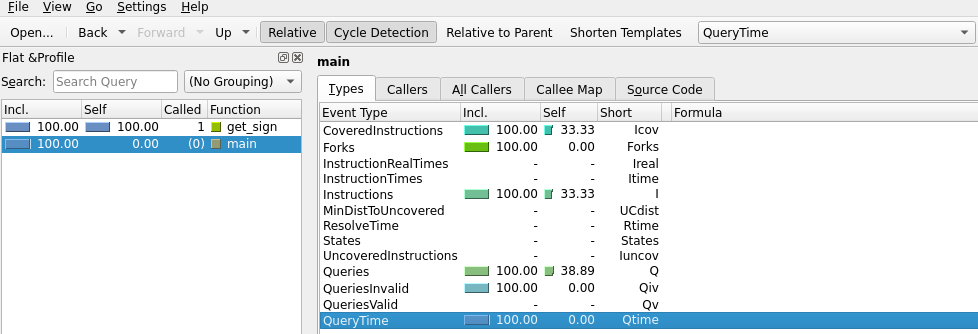
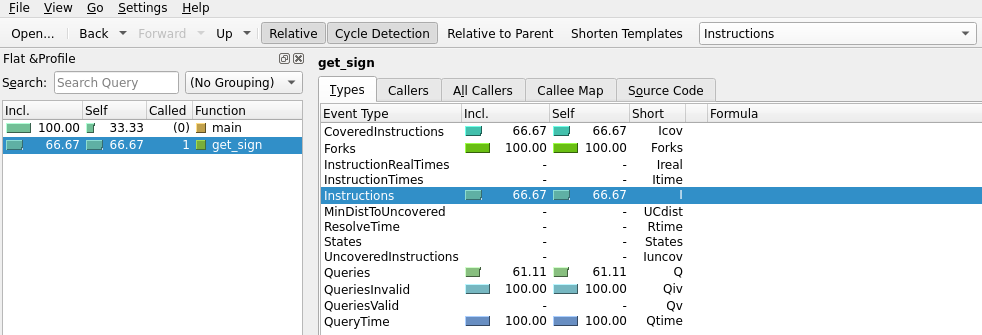

# KLEE 快速入门：测试一个小函数

[官方教程](https://klee-se.org/tutorials/testing-function/)

欢迎！本 README 面向 **KLEE**（一个基于 LLVM 的动态符号执行工具）的初学者。我们将通过一个简单示例，带你了解 **如何用 KLEE 自动生成测试用例**。

---

## 1. 示例函数

我们要测试的函数如下，用于判断整数 `x` 的符号：

```c
int get_sign(int x) {
  if (x == 0)
    return 0;

  if (x < 0)
    return -1;
  else
    return 1;
}
```

逻辑示意图：

```
        +------+
   x==0 | Yes  | return 0
        +------+
            |
            v
        +-----------+
  x<0?  | Yes       | return -1
        | No        | return 1
        +-----------+
```

KLEE 将会探索这 3 条路径，并为每条路径生成一个测试用例。

⸻

## 2. 编写测试驱动（test driver）

我们需要一个 main()，把输入 a 变成符号变量：

```c
#include "klee/klee.h"

int get_sign(int x);

int main() {
  int a;
  klee_make_symbolic(&a, sizeof(a), "a");
  return get_sign(a);
}
```

这里的 klee_make_symbolic() 是关键：
👉 它告诉 KLEE "把 a 看作可以取任何值"。

⸻

## 3. 编译为 LLVM 位码

运行以下命令生成 .bc 文件：

```bash
$ clang -I ../../include -emit-llvm -c -g -O0 -Xclang -disable-O0-optnone get_sign.c
```

得到 get_sign.bc，这就是 KLEE 可以执行的输入。

⸻

## 4. 运行 KLEE

执行：

```bash
$ klee get_sign.bc
```

KLEE 会输出类似结果：

```
KLEE: output directory = "klee-out-0"
KLEE: done: total instructions = 33
KLEE: done: completed paths = 3
KLEE: done: generated tests = 3
```

结果解读：
* completed paths = 3 ：三条不同执行路径
* generated tests = 3 ：三个对应测试用例

效果图示例（终端输出）：

（图片仅示意，可能与实际输出不同）

⸻

## 5. 输出目录

KLEE 的结果保存在 klee-out-0 文件夹，结构大致如下：

```
klee-out-0/
├── assembly.ll
├── info
├── run.stats
├── run.istats
├── test000001.ktest
├── test000002.ktest
└── test000003.ktest
```

其中：
* test00000X.ktest 就是生成的测试用例；
* run.stats 记录统计数据；
* info、messages.txt 用于调试和查看运行信息。

KLEE 还会自动生成一个 符号链接 klee-last 指向最新的结果目录，便于快速访问。

⸻

## 6. 可视化路径覆盖

你可以用 ktest-tool 来查看测试用例内容：

```bash
$ ktest-tool klee-last/test000001.ktest
```

输出类似：

```
ktest file : 'klee-last/test000001.ktest'
args       : ['get_sign.bc']
num objects: 1
object 0: name: 'a'
object 0: size: 4
object 0: data: 00 00 00 00
```

这里 a = 0，对应 return 0 的路径。

⸻

## 7. 结果分析和验证

#### 基础统计信息分析

**查看执行统计：**
```bash
# 基本统计信息
$ klee-stats klee-last

# 详细统计（包含表格格式）
$ klee-stats --table-format klee-last

# 比较多个运行结果
$ klee-stats klee-out-* | sort -n -k 2
```

**典型统计信息含义：**
```
| Path     | Instrs  | Time(s) | ICov(%) | BCov(%) | ICount | TSolver(%) |
|----------|---------|---------|---------|---------|--------|------------|
|klee-last | 33      | 0.02    | 100.0   | 100.0   | 27     | 86.71      |
```
- **Instrs**: 执行的LLVM指令数
- **Time(s)**: 总执行时间
- **ICov(%)**: 指令覆盖率
- **BCov(%)**: 分支覆盖率
- **ICount**: 生成的测试用例数
- **TSolver(%)**: 约束求解器时间占比

#### 高级可视化分析

**使用KCachegrind进行指令级分析：**
```bash
# 启动KCachegrind查看详细性能分析，需要先设置 DISPLAY 参数
$ kcachegrind klee-last/run.istats
```




**KCachegrind中的关键指标：**
- **Incl.（Inclusive）**：包含该函数自身以及它调用的函数的占比。
- **Self**：仅该函数自身的占比（不含被调函数）。
- **Called**：函数被调用次数。
- **Function**：函数名称。

在图中：
```
•	main：
  •	Incl. = 100%，说明几乎所有的执行路径都从 main 开始。
  •	Self = 33.33%，说明 main 自身包含了三分之一的指令，其余来自调用的函数。
•	get_sign：
  •	Incl. = 66.67%，占总执行指令的 2/3。
  •	Self = 66.67%，说明这个函数的执行全部来自自身逻辑。
```

- **CoveredInstructions (lcov)**：被执行的指令百分比。
get_sign：66.67%，说明它的代码大部分被执行到了。
- **Forks**：路径分叉次数。
这里为 100%，表明所有分支条件都被考虑过。
- **Instructions (I)**：总指令数占比。
get_sign 自己是 66.67%，也就是程序三分之二的执行量在这个函数。
- **Queries / QueriesValid / QueriesInvalid**：KLEE 与 SMT 求解器交互的次数。
- **Queries (Q)**：总查询次数。
- **QueriesValid (Qv)**：有效查询（占比 100%）。
- **QueriesInvalid (Qiv)**：无效查询（占比 100%，这里看上去统计有点偏，但一般代表 SMT 求解都发生了）。
- **QueryTime (Qtime)**：查询求解花费的时间百分比，这里是 100%，说明求解时间几乎都花在 get_sign 函数。


## 8. 重新执行测试用例（Replaying a test case）

虽然我们可以手动运行 KLEE 生成的测试用例（或使用现有测试框架），但 KLEE 提供了便捷的重执行库 `libkleeRuntest`，它会将对 `klee_make_symbolic()` 的调用替换为从 `.ktest` 文件中读取值的函数调用。

### 使用重执行库的步骤：

**① 设置库路径**
```bash
$ export LD_LIBRARY_PATH=path-to-klee-build-dir/lib/:$LD_LIBRARY_PATH
```

**② 编译原程序并链接重执行库**
```bash
$ clang -o a.out -I /tmp/klee_src/include -L /tmp/klee_build130stp_z3/lib -lkleeRuntest get_sign.c
```

**或者** 采取先`编译`再`链接`的方式（更稳定）：

```bash
$ gcc -I /tmp/klee_src/include -L /tmp/klee_build130stp_z3/lib \
  -c get_sign.c -o get_sign.o && \
  gcc get_sign.o -o a.out -L /tmp/klee_build130stp_z3/lib \
  -lkleeRuntest && rm -f get_sign.o
$ ls
a.out  get_sign.bc  get_sign.c  klee-last  klee-out-0
```

**③ 使用 KTEST_FILE 环境变量指定测试用例并运行**

测试第一个用例（a = 0）：
```bash
$ KTEST_FILE=klee-last/test000001.ktest ./a.out
$ echo $?
0
```

测试第二个用例（a = 16843009，正数）：
```bash
$ KTEST_FILE=klee-last/test000002.ktest ./a.out
$ echo $?
1
```

测试第三个用例（a = -2147483648，负数）：
```bash
$ KTEST_FILE=klee-last/test000003.ktest ./a.out
$ echo $?
255
```

### 结果解析：
* 第一个测试：返回值为 0（输入为 0）
* 第二个测试：返回值为 1（输入为正数）
* 第三个测试：返回值为 255（-1 转换为有效的退出码，范围 0-255）

**重要提示：** `libkleeRuntest` 库会自动替换 `klee_make_symbolic()` 调用，从指定的 `.ktest` 文件中读取具体的测试值，让你能够在原生环境中重复执行 KLEE 生成的测试场景。

⸻

## 9. 学习小结

| 步骤 | 学到的知识 |
|------|------------|
| 测试驱动 | 使用 klee_make_symbolic() 让输入变成符号变量 |
| 编译 | 生成 LLVM bitcode .bc 文件供 KLEE 执行 |
| 运行 | KLEE 自动探索不同路径，生成覆盖完整逻辑的测试用例 |
| 输出分析 | 查看 .ktest 文件，理解不同路径对应的输入 |
| 重执行测试 | 使用 libkleeRuntest 在原生环境中验证测试用例 |

⸻

## 10. 下一步学习

当你掌握了这个小例子，可以继续学习：
* 符号化命令行参数、stdin、文件
* KLEE 测试正则表达式库
* 使用 KLEE 测试 GNU Coreutils

⸻

最后寄语

这就是 KLEE 的基本用法：
写测试驱动 → 编译 → 运行 KLEE → 得到自动生成的测试 → 重执行验证。

有了它，你可以轻松探索复杂程序的不同执行路径！🚀

⸻

👉 更多教程请见 [KLEE官方教程](https://klee-se.org/docs/#tutorials)。
